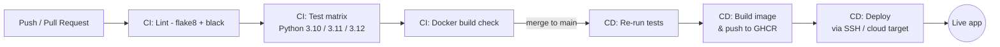

# Automated CI/CD Pipeline with GitHub Actions

A small, working DevOps reference project: a Flask API with a **CI pipeline**
(lint, test, build-check) and a **CD pipeline** (build → publish to a
container registry → deploy) both implemented in GitHub Actions.

The app itself is intentionally simple — a Task API — so the pipeline is the
star of the project.

## Pipeline overview



- **`.github/workflows/ci.yml`** — runs on every push to a branch and every
  PR into `main`. Lints with flake8, checks formatting with black, runs the
  pytest suite across three Python versions, then does a throwaway Docker
  build to catch a broken `Dockerfile` early.
- **`.github/workflows/cd.yml`** — runs on push to `main` (and on `v*.*.*`
  tags). Re-runs the tests, builds the Docker image, pushes it to GitHub
  Container Registry (GHCR) with `latest` + short-SHA + semver tags, then
  deploys it.
- **`.github/dependabot.yml`** — opens weekly PRs to bump pip packages,
  GitHub Actions versions, and the base Docker image, so the pipeline stays
  itself up to date.

## Project structure

```
.
├── app/
│   ├── __init__.py
│   └── main.py              # Flask API (health check + task CRUD)
├── tests/
│   └── test_main.py         # pytest suite
├── .github/
│   ├── workflows/
│   │   ├── ci.yml
│   │   └── cd.yml
│   └── dependabot.yml
├── Dockerfile
├── docker-compose.yml
├── requirements.txt
├── requirements-dev.txt
└── Makefile
```

## Running locally

```bash
make install
make run        # serves on http://localhost:5000
```

```bash
curl http://localhost:5000/health
curl -X POST http://localhost:5000/tasks -H "Content-Type: application/json" -d '{"title":"ship it"}'
curl http://localhost:5000/tasks
```

## Running with Docker

```bash
make docker-build
make docker-run
```

## Running the checks the pipeline runs

```bash
make lint
make format   # auto-fixes formatting
make test
```

## Setting this up on your own repo

1. Push this project to a new GitHub repository.
2. **CI needs nothing extra** — it works out of the box using the built-in
   `GITHUB_TOKEN`.
3. **CD → GHCR** also works out of the box: GitHub Container Registry auth
   uses the built-in `GITHUB_TOKEN`, and images will appear under
   `ghcr.io/<your-username>/<repo>`. Set the package's visibility to public
   in the repo's **Packages** tab if you want it pullable without auth.
4. **CD → deploy step**: the workflow ships with an SSH deploy to a
   docker-compose host. In your repo's **Settings → Environments**, create a
   `production` environment (this also lets you require manual approval
   before deploys) and add these secrets:
   - `DEPLOY_HOST` — server IP/hostname
   - `DEPLOY_USER` — SSH user
   - `DEPLOY_SSH_KEY` — private key with access to that user
   - Optionally a `PRODUCTION_URL` environment variable for the deployment
     link shown in the GitHub UI.

   If you're deploying somewhere else, swap the `deploy` job for one of the
   commented-out alternatives in `cd.yml` (AWS ECS, Azure Web Apps,
   Kubernetes, or a Render/Fly.io/Heroku deploy hook).

## Why it's split into two workflows

Keeping CI and CD separate means:
- CI runs on **every** branch/PR — fast feedback before anything touches `main`.
- CD only runs on `main`/tags, and only after tests pass again, so a flaky
  local rebase or force-push can't skip verification.
- The `production` GitHub Environment gate lets you add required reviewers
  for deploys without slowing down day-to-day CI.
